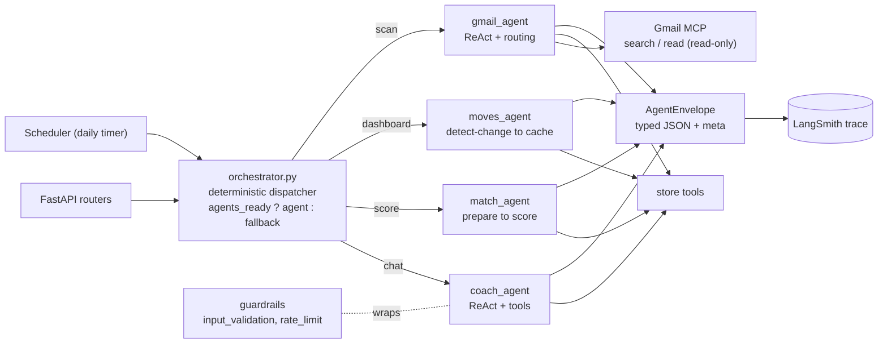

# Resume Tracker

A career copilot: upload resumes → build an editable mind map of your skills &
experience → browse jobs and get an AI fit score → prep interview questions by
round → track applications on a draggable board → chat with an AI coach.

Two-tier app, each piece swappable without touching the rest: **FastAPI**
backend (parsing, scoring, storage, coach) + **React/Vite** frontend (hand-drawn
UI). Runs **fully offline** out of the box (mock parser + heuristic scoring) and
upgrades to **LlamaParse + Gemini** by adding two keys.

The AI features are now driven by an **agentic layer built on LangGraph**: four
single-responsibility agents (job-match scoring, daily "moves", a tool-using
coach, and a Gmail inbox tracker) sit behind the existing endpoints. Agents are
fully optional — without the agent packages or keys, every route falls back to
the original heuristic/Gemini path and the app still runs offline. See
[`backend/AGENTS.md`](backend/AGENTS.md) for the design and
[`backend/SETUP_AGENTS.md`](backend/SETUP_AGENTS.md) for setup.

## Screens

## Deliverable 1 — Agentic workflow

**Decision sequence.** When the daily scan runs (or `POST /api/agents/gmail/scan`),
the **Gmail Auto-Track agent** reads recent inbox messages for each tracked
company, classifies the latest relevant email, and proposes a **forward-only**
application-stage update — committed only at **confidence ≥ 0.6**.

**Why an agent, not a workflow.** Email phrasing varies without bound (invites,
assessments, soft rejections, "kept on file"), so the classify-and-decide step
needs model judgement at runtime rather than hardcoded rules. The other jobs
(match scoring, daily moves) are deterministic workflows by design — see
`backend/AGENTS.md`.

**Anthropic pattern.** **Routing** (classify intent → branch to a stage
decision), executed inside a tool-using ReAct loop over the Gmail MCP.

**Success metric (measured by the test suite).** The Gmail writer must be
forward-only and confidence-gated (acts only at ≥ 0.6), never regress a stage,
and never crash on a malformed proposal. Measured by `gmail_state_integrity` in
`tests/robustness_test.py`: **5/5 (100%)** in the latest run.

## Deliverable 2 — Architecture

**Model chosen: ReAct (single agent) per task — composed by a deterministic
dispatcher, not a Supervisor.** Each agent is a scoped ReAct loop (or a tiny
state graph); `orchestrator.py` routes each event to exactly one agent.



**Justification.** Each job is a bounded, scoped task triggered by an unrelated
event, so one ReAct agent per task is the right granularity; a deterministic
dispatcher routes events with no extra model round-trip.

**Trade-off accepted.** ReAct is brittle as the tool count grows and offers
limited in-turn parallelism. We accept this because each agent's tool set is
small and the agents never run concurrently within a turn; the typed envelopes
let us promote the dispatcher to a LangGraph Supervisor later without touching
the agents.

| Tab | What it does |
| --- | --- |
| **Dashboard** | Greets you by name, summarizes stats, and lists your 3 "moves for today" — produced by the **moves agent**, which only recomputes when your skills, experience, or tracker actually change (otherwise it serves a cache). |
| **Resumes** | Upload many resumes (cards); one is **active**. Editable skills/experience **mind map** below — click any node to edit; experiences show the title and open full details on click. |
| **Jobs** | Hardcoded tech entry-level roles. Click one → the **match agent** evaluates your fit score vs the active resume. **Apply** (adds to tracker) or **Tailor my resume** (placeholder). |
| **Tracker** | Drag cards between stages. **Auto-Track with Gmail** toggle (top-left) flags a job for the **Gmail agent**, which scans your inbox daily and auto-advances statuses. Each card has **Prep with AI Coach** → pick HR / Hiring Manager / Team Fit → questions drafted from the JD. |
| **AI Coach** | Chat with the **coach agent** (LangGraph ReAct) — it decides on its own which tools to call (your skills, experience, tracked jobs, or a specific JD). Guardrails validate input and rate-limit token usage. Mock interviews, resume review, fit advice. |

## Architecture

```
backend/app/
  main.py            FastAPI app + router wiring + lifespan (LangSmith, scheduler)
  config.py          env flags (keys → feature toggles, incl. agents/Gmail/guardrails)
  models.py          Pydantic shapes (Resume, Job, Score, Coach…)
  store.py           JSON persistence + migration; agent_state (moves cache, gmail log)
  catalog.py         hardcoded job catalog
  services/
    parser.py        ResumeParser: Mock | LlamaParse (PDF→md→Gemini→JSON)
    llm.py           LLMService: Heuristic | Gemini (score, questions, coach) — fallback
  agents/            LangGraph agentic layer
    schemas.py       JSON envelopes every agent speaks (AgentEnvelope + payloads)
    runtime.py       Gemini chat model, LangSmith setup, timing/token helpers
    tools.py         store-backed LangChain tools for the coach
    mcp_client.py    Gmail MCP → LangChain tools (langchain-mcp-adapters)
    match_agent.py   graph: prepare → score              (MatchResult)
    moves_agent.py   graph: detect_change → generate/cache (MovesResult)
    coach_agent.py   prebuilt ReAct agent + tools          (CoachResult)
    gmail_agent.py   ReAct + Gmail MCP, applies tracker updates (GmailScanResult)
    orchestrator.py  the ONE dispatcher routers call (agent vs fallback)
    scheduler.py     in-process daily Gmail scan loop
  guardrails/
    input_validation.py  length / sanitize / prompt-injection flagging
    rate_limit.py        requests-per-min + daily token budget
  skills/              one SKILL.md per agent (coach, daily_moves, job_match, gmail_tracking)
  routers/
    resume.py        upload / list / activate / delete resumes
    profile.py       edit the ACTIVE resume (mind map CRUD)
    jobs.py          catalog, evaluate (→ match agent), tracker, prep-by-round
    dashboard.py     fast stats, moves (→ moves agent), top matches
    coach.py         chat (→ coach agent, behind guardrails)
    agents.py        agent status, manual Gmail scan, scan log, moves refresh
frontend/src/
  App.jsx            tab shell + shared state
  api.js             one API client (incl. /agents/* endpoints)
  components/        Dashboard, ResumesTab, MindMapEditable, JobsTab,
                     TrackerTab, CoachTab, Modal
```

Design choices (per "best architecture, no bloat"):
- **Pluggable providers.** `get_parser()` / `get_llm()` pick the real or offline
  implementation from env vars; nothing else branches on it.
- **Agents over the same seam.** `orchestrator.py` routes each call to the right
  LangGraph agent when ready, else to the existing `get_llm()` path — so the
  agentic upgrade preserved the pluggable design and the offline fallback.
- **No supervisor (on purpose).** The four agents are triggered by unrelated
  events and never collaborate within a turn, so a deterministic dispatcher is
  enough; a supervisor would add a model round-trip for no routing benefit.
- **Structured handoffs.** Agents return typed JSON envelopes, never bare text.
- **Change-detected moves.** The moves agent fingerprints skills + experience +
  tracker and skips the model entirely when nothing changed.
- **Active-resume = profile.** The mind map reads and writes whichever resume is
  active, so multi-resume came free.
- **Fast vs. accurate split.** Dashboard/top-matches use the instant heuristic;
  the explicit "Evaluate" and "Coach" actions use Gemini.
- **No drag library.** The tracker uses native HTML5 drag-and-drop.

## Run it

**Requirements:** Python 3.10+ and Node.js 18+.

```bash
# terminal 1 — backend
cd backend
python3 -m venv .venv && source .venv/bin/activate
pip install -r requirements.txt
cp .env.example .env          # then add your GEMINI_API_KEY
uvicorn app.main:app --reload

# terminal 2 — frontend
cd frontend
npm install
npm run dev
```

```bash
# terminal 1 — backend
cd backend
pip install -r requirements.txt        # google-genai, llama-parse + LangGraph stack
uvicorn app.main:app --reload          # http://localhost:8000/docs

# terminal 2 — frontend
cd frontend
npm install
npm run dev                            # http://localhost:5173
```

## Keys (already scaffolded in `backend/.env`)

```
LLAMA_CLOUD_API_KEY=...   # real resume parsing (LlamaParse)
GEMINI_API_KEY=...        # AI scoring, interview questions, coach (Gemini)
GEMINI_MODEL=gemini-2.0-flash
```

Paste your keys and restart uvicorn. With both set: PDFs are parsed by
LlamaParse and structured by Gemini; fit scores, questions, and coach replies
are all Gemini. Leave either blank to fall back to the offline mock/heuristic for
that feature — the app still runs end-to-end.

## Agentic layer (LangGraph)

The agents reuse your `GEMINI_API_KEY` as their LLM and are controlled by extra
flags in `backend/.env` (all default-safe):

```
AGENTS_ENABLED=true              # master switch (needs GEMINI_API_KEY)
LANGSMITH_API_KEY=...            # optional: traces every agent run
LANGSMITH_PROJECT=resume-tracker
GMAIL_MCP_ENABLED=false          # Gmail inbox → tracker auto-update
GMAIL_DAILY_SCAN=false           # run the scan once a day in-process
COACH_MAX_INPUT_CHARS=4000       # chat guardrails
COACH_DAILY_TOKEN_BUDGET=200000
COACH_MAX_REQUESTS_PER_MIN=12
```

- **No keys / packages?** Every route falls back to the heuristic/Gemini path —
  the app is unchanged.
- **Gmail tracking** needs a one-time Google OAuth and the Gmail MCP server.
  Full walkthrough in [`backend/SETUP_AGENTS.md`](backend/SETUP_AGENTS.md).
- **Inspect the agents:** `GET /api/agents/status`, `GET /api/health` (now
  includes an `agents` block), and LangSmith (if keyed).
- **Control endpoints:** `POST /api/agents/gmail/scan`, `GET /api/agents/gmail/log`,
  `POST /api/agents/moves/refresh`.

Architecture and the no-supervisor rationale live in
[`backend/AGENTS.md`](backend/AGENTS.md).

## If AI features "aren't working"

1. **Reinstall after pulling new code:** `pip install -r requirements.txt`. The
   old pin (`google-genai==0.3.0`) predates the client API the code uses; the
   requirements now need **`google-genai>=1.0.0`**. An out-of-date SDK was the
   original cause — every Gemini call threw and silently fell back to keyword
   scoring (that's why old scores say `"method": "heuristic"`).
2. **Check the live status:** open `http://localhost:8000/api/health`. It now
   does a real Gemini ping and returns `gemini.ok: true` or an `error` string.
3. **Watch the uvicorn console:** provider failures are printed (`[llm] …`,
   `[parser] …`) instead of being hidden.
4. **Key format:** a Google AI Studio key normally looks like `AIza…`. If your
   key is rejected, regenerate one at https://aistudio.google.com/apikey and
   paste it into `backend/.env`, then restart uvicorn.
5. **`429 RESOURCE_EXHAUSTED`** = your key works but you've hit Google's free
   quota for the model. The app keeps running on the offline scorer and
   auto-upgrades to Gemini once quota returns. To get AI back sooner:
   - wait for the quota window to reset (free tier is limited per-minute *and*
     per-day), or
   - set `GEMINI_MODEL=gemini-2.0-flash-lite` in `.env` (lighter, higher free
     throughput), or
   - enable billing on the key's Google Cloud project (Flash is very cheap).
   Catalog evaluations are cached per (job, profile), so re-opening a job or
   applying to one you just scored makes **no** extra API call.

## Still placeholders (by request)

- **Tailor my resume** button (Jobs dialog) — non-functional.

### No longer a placeholder
- **Auto-Track with Gmail** is now wired to the `gmail_agent`: the toggle flags a
  job for the daily inbox scan, which reads recent mail via the Gmail MCP and
  auto-advances the card's status (forward-only, ≥0.6 confidence; rejections
  anytime). It stays inert until you complete the Gmail MCP setup in
  `backend/SETUP_AGENTS.md`. Trigger a scan now with `POST /api/agents/gmail/scan`.
